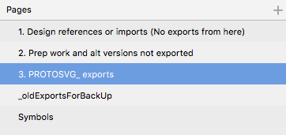
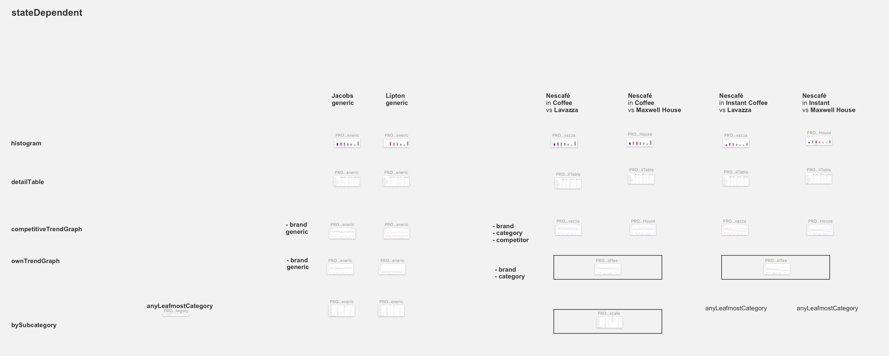
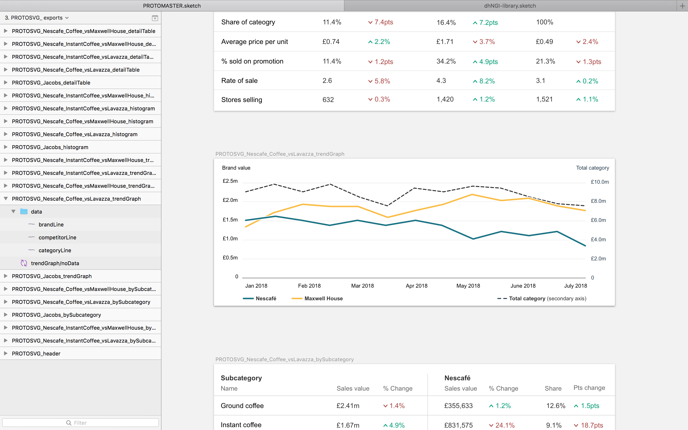

# Assets creation and management

## Where prototype images come from

### All assets come from __1 sketch file__ named `PROTOMASTER.sketch`.
I.e. if I want to add something new, I either produce it in here, or I paste it in that sketch file and export the slices from that sketch file.

#### It is located in the version controlled project folder, in a `sketchsource` folder
which is a sibbling of `src`.

## Where the asset names come from

If an asset comes from Sketch, it is __named within sketch__ (i.e. the name is the name of the slice I use to export the asset) and __this asset name is never modified later__.

This allows me to always easily be able to find the source sketch elements of an image, quickly do modifications, reexport the asset in the same location, and see the changes immediately in the app without any extra work. 


## Where to put assets

Images are stored in an `assets` folder, inside the `src` folder.


## The AssetLoader component: How to preload images managed by Webpack (i.e. included in my src/ directory)

There are techniques for preloading images, but a lot of them don't work if you manage assets as part of your Webpack system (which is recommended as assets are hashed, and you get build-time errors if any are missing).

Solution: 
- Create an `AssetsLoader` component, inside the `./assets/` folder.
- The job of this component is to:

	- Import _all_ image assets used throughout the app, and export them immediately
	- Render _all_ image assets within a div that is `visibility: hidden`, 0 `height`, 0 `width` and `overflow: hidden` so that the images do not show there – but they are pre-loaded
	- Provide a single file to import any image or svg asset from. I.e. all assets are placed in the `assets` folder, imported in the `AssetsLoader` file, structured in objects, and exported from that.

- __All other components throughout the app which need image assets, import the constants that hold the right image asset from `./assets/AssetsLoader.tsx/`. (not from the asset file itself folder).__

- `App.tsx` imports the `AssetsLoader` component directly (it's the only component that does), and renders it right at the bottom of the page, so that all images are pre-loaded as part of the initial app loading.

```
return (
    <div>
        <header
            className={styles.headerContainer}
        >
            
        </header>

        <main
            className={styles.main}
        >
            ...
        </main>     

        <div
            className={styles.footerContainer}
        />

        <AssetsLoader />
    </div>
)
```

### Structure of the AssetLoader component

#### The component just renders all the assets in `images`, in a `div` that is at the bottom of page (in `App`) but hidden.
(I don't bother doing this for `svgs` but I could, just by adding a line of code).

```
export class AssetsLoader extends React.Component<{}, {}> {
    render() {

        // Pre-loading all assets, as AssetsLoader is inserted at the end of App
        return (
            <div
                className={styles.ImageLoader}
            >
                {
                    utils.flattened(images).map(
                        (imageAssetString: string, index: number) => 
                    )
                }
            </div>
        )
    }
}
```

#### To do this, I use a hand-rolled flattening function: 
it takes an object, and turns it into an array of strings.
This works because I know that the values in the `images` object, at any level, will other ever be either strings (returned by the require statement) or nested objects.


```
interface ObjectToFlatten {
    [k: string]: object | string | number | boolean | undefined
}

export const flattened = (objectToDeeplyFlatten: ObjectToFlatten): string[] => {
    let result: string[] = []

    function recursivelyFlatten(obj: ObjectToFlatten) {

        Object.values(obj).forEach(
            (objectOrString: ObjectToFlatten) => {

                if (
                    (typeof objectOrString === 'string') ||
                    (typeof objectOrString === 'number') ||
                    (typeof objectOrString === 'boolean') ||
                    (typeof objectOrString === 'undefined')
                ) {
                    result.push(objectOrString)
    
                } else if (typeof objectOrString === 'object') {
                    recursivelyFlatten(objectOrString)
                }
            }
        )
    }

    recursivelyFlatten(objectToDeeplyFlatten)

    return result
}
```

#### This is how the div is hidden:
I could put this css in line for simplicity.


```
.ImageLoader {
    visibility: hidden;
    width: 0;
    height: 0;
    overflow: hidden;
}
```


### AssetLoader.tsx (beyond the component definition): How to structure assets in `AssetsLoader` for exporting

1. images and svg on separate named exports, `images` and `svgs`

2. on `svgs` or `images`, I just differentiate between assets that are not state dependents, and those that are

3. then, by type of asset (e.g. `histogram`)

4. then first handling out the generic assets (e.g. here `Jacobs` and `Liptop`). I do this because the logic I will write in assetsGetter to fetch these assets needs to closely follow the structure of this file for simplicity

5. then, I start handling the different states that matter, starting with the most fundamental ones (e.g. `Coffee` vs `Instant Coffee`), then more granular ones (e.g. `Lavazza` vs `Maxwell House`).


```
export const images = {}

export const svgs = {
    nonStateDependent: {
        header: require('./PROTOSVG_header.svg') as string,
    },

    stateDependent: {

        // FOLLOW THE SAME LOGIC, USING BRAND, CATEGORY AND SELECTOR

        histogram: {
            'Jacobs': {
                generic: require('./PROTOSVG_histogram_Jacobs_generic.svg') as string,
            },
            'Lipton': {
                generic: require('./PROTOSVG_histogram_Lipton_generic.svg') as string,
            },
            'Nescafé': {
                'Coffee': {
                    'Lavazza': require('./PROTOSVG_histogram_Nescafe_Coffee_vsLavazza.svg') as string,
                    'Maxwell House': require('./PROTOSVG_histogram_Nescafe_Coffee_vsMaxwellHouse.svg') as string,
                },
                'Instant coffee': {
                    'Lavazza': require('./PROTOSVG_histogram_Nescafe_InstantCoffee_vsLavazza.svg') as string,
                    'Maxwell House': require('./PROTOSVG_histogram_Nescafe_InstantCoffee_vsMaxwellHouse.svg') as string,
                },
            },
        },

        detailTable: {
            'Jacobs': {
                generic: require('./PROTOSVG_detailTable_Jacobs_generic.svg') as string,
            },
            'Lipton': {
                generic: require('./PROTOSVG_detailTable_Lipton_generic.svg') as string,
            },
            'Nescafé': {
                'Coffee': {
                    'Lavazza': require('./PROTOSVG_Nescafe_Coffee_vsLavazza_detailTable.svg') as string,
                    'Maxwell House': require('./PROTOSVG_Nescafe_Coffee_vsMaxwellHouse_detailTable.svg') as string,
                },
                'Instant coffee': {
                    'Lavazza': require('./PROTOSVG_Nescafe_InstantCoffee_vsLavazza_detailTable.svg') as string,
                    'Maxwell House': require('./PROTOSVG_Nescafe_InstantCoffee_vsMaxwellHouse_detailTable.svg') as string,
                },
            },
        },

        // competitiveTrendGraph, 1. Brand generic 2. brand + category + competitor

        competitiveTrendGraph: {
            'Jacobs': require('./PROTOSVG_CompetitiveTrendGraph_Jacobs_generic.svg') as string,
            'Lipton': require('./PROTOSVG_CompetitiveTrendGraph_Lipton_generic.svg') as string,
            'Nescafé': {
                'Coffee': {
                    'Lavazza': require('./PROTOSVG_CompetitiveTrendGraph_Nescafe_Coffee_vsLavazza.svg') as string,
                    'Maxwell House': require('./PROTOSVG_CompetitiveTrendGraph_Nescafe_Coffee_vsMaxwellHouse.svg') as string,
                },
                'Instant coffee': {
                    'Lavazza': require('./PROTOSVG_CompetitiveTrendGraph_Nescafe_InstantCoffee_vsLavazza.svg') as string,
                    'Maxwell House': require('./PROTOSVG_CompetitiveTrendGraph_Nescafe_InstantCoffee_vsMaxwellHouse.svg') as string,
                },
            }
        },

        // ownTrendGraph, 1. Brand generic 2. brand + category

        ownTrendGraph: {
            'Jacobs': require('./PROTOSVG_ownTrendGraph_Jacobs_generic.svg') as string,
            'Lipton': require('./PROTOSVG_ownTrendGraph_Lipton_generic.svg') as string,
            'Nescafé': {
                'Coffee': require('./PROTOSVG_ownTrendGraph_Nescafe_Coffee.svg') as string,
                'Instant coffee': require('./PROTOSVG_ownTrendGraph_Nescafe_InstantCoffee.svg') as string,
            }
        },

        // FOLLOW A DIFFERENT LOGIC, USING CATEGORY.HIERARCHYLEVEL AND BRAND

        bySubcategory: {
            'Jacobs': require('./PROTOSVG_bySubcategory_Jacobs_generic.svg') as string,
            'Lipton': require('./PROTOSVG_bySubcategory_Lipton_generic.svg') as string,
            'Nescafé': {
                'Coffee': require('./PROTOSVG_bySubcategory_Nescafe.svg') as string,
                'Instant coffee': require('./PROTOSVG_bySubcategory_anyL2Category.svg') as string,
            }
        }
    }    
}
```


### How to type asset imports

Webpack asset loader will return a string for any return statement.

__I asset the value of each require statement to be a string, so that TS will warn me if I'm trying to access something that is undefined.__


## How I name assets

1. All image name begin with `PROTOIMG_`. All svgs begging with `PROTOSVG_`.
This allows me to easily find all the slices for the prototying inside the source sketch file by searching the document for `PROTOIMG_`.

2. The next bit of the file name says what the type of the image is, so that all images are organised in types. Eg `nav`, `table`, `graph`, etc.

2. Then, the name of the asset says what state the asset corresponds to – starting with the most high level states, working its way down. The type of asset is right at the end of the name. If I export different versions of the same image (eg to represent different states of the app), only the very last bit of the filename should change.


__The path to access any asset needs to always exactly match the name of the asset (for my sanity)__.


## Prefer svg over images

Images are heavier and blurry. They need to be pro-loaded.
Svgs are crisp and light. They don't need preloading.

## How to export svg from Sketch

- Export from artboards (not right clicking on a group or a slice).
- Just export the artboard as .svg in the same way that I'd export it as .png
- I have the Sketch plugin SVGO compressor installed. It does its job automatically

### Gotchas and ways around

#### Align bottom for multi lines texts not working
Instead, use align top, and insert a new line on first line


## How I orgamyse my sketch file

### Pages



### 1. Design references or imports (No exports from here)

Anything that's imported in sketchsource is imported here.

### 2. Prep work and alt versions not exported

This is a playground right inside Sketch source.


But it's better to use a regular playground, outside Sketch source, for this.

### 3. PROTOSVG_ exports: Organising assets to be exported

__I only export artboards, rather than slices.__ (This is true for both .png and .svg exports). So this is about organising artboards.

All artboards for export are located in the `3. PROTOSVG_ exports` page.
The page is named like this, because any artboard there that will be exported is named with a title that starts with `PROTOSVG_` (or `PROTOIMG_` if it's an image).

I first separate between assets that are __non state dependent__, and assets that are __state dependent__.

High level view:


#### Organising state dependent assets for export

Each component is a separate row.

Within this row, each state of the component is a separate column.

In some cases, I will use one asset for different states. To show this on the grid, I either draw a rectangle (if the two states are adjacent), or I give that asset a title (eg. `anyLeafmostCategory`) and use that title anywhere in the grid where I will use that asset.

Zoomed in view:


Different components will show different states (e.g. ownTrendGraph cares about the brand and the category, while competitiveTrendGraph also cares about the selected competitor). I list what state a component depends on in the relevant row, not at the left, but after the 'generic' cases which are simplified and won't care about that.

### 4. Symbols: Using Sketch symbols to rapidly iterate prototype assets

## Create symbols, then make different instances of the symbol with different data / content

Don’t just duplicate artboards to create different state-versions of data/content for an app.
Instead, take a few minutes to create a symbol, which I will instantiate several times with different data.

Put these symbols in the ’Symbols’ page of the ‘PROTO_MASTER’ doc.


## Creating symbols so that they're easy to override

#### 1 Organise and order:
- Organise the elements into clear groups
- Within each group, order the elements, following a natural reading order (left to right, then top to bottom)

#### 2 Name:
- Name the elements with short, consistent, easily scannable names – so I can find and override these properties easier
- Mark any text element or nested symbol that I will not need to override for the different instances as private (_elementName)


#### 3 Text elements overriding: 
- Make sure that text fields can accomodate long enough content for the different instances’ data. (eg I can use align right, or allign bottom, with ample boxes)


#### 4 Nested symbols overriding: 
If instances customisation will require the use of a different element, create a separate atomic symbol (along with alternative versions). With just that element, and nest it in the symbol. If a symbol has nested symbols, I can override each of the nested symbols on the symbol’s instance.


#### 5 Use nested symbols overriding because text styles overriding isn’t yet possible in Sketch
Sketch allows symbol instances to have a different text content, but not a different text style.
The workaround is to create a symbol for the text element (and alternative versions of the text symbol with different styles), and then to nest that symbol in my symbol.
To do this, in the ‘Symbols’ page of the ‘PROTO_MASTER’, create an artboard that has the same size as the text element I want to symbolise. Then copy and paste the text element in it, and convert the artboard into a symbol. Then back into the higher-order symbol, replace the element with the symbol (i.e. nesting a symbol in place of an element).


Note: I can create these more atomic symbols for nesting either in the ‘Symbols’ page of the ‘PROTO_MASTER’ doc, or in the project’s shared library (if I think that the symbol will be reused somewhere else).

### Case 1: When text content and nested symbol overriding _are_ sufficient to customise the symbols with different data/content

Then in the ‘PROTOSVG_ exports’ page
    - create an artboard that’s the same size as the symbol
    - insert the symbol on the artboard
    - use text overrides, and nested symbol overrides, to customise each instance with the right data/content

### Case 2: When text content and nested symbol overriding _aren't_ sufficient to customise the symbols with different data/content

The customisation of the instances may require things that are not easy with text or nested symbols override:
eg
- different line graphs
- different size bars

When that’s the case:
In the ‘Symbols’ page of ‘PROTO_MASTER’:
1. Create/Paste a model for the future symbol as an artboard
2. Make it all perfect
3. Make a backup
4. Remove the data / anything that I wouldn’t be able to customise via text/nested symbols overriding
5. Turn this artboard without data into a symbol, eg `trendGraph/noData`
6. Still in ‘Symbols’ page of ‘PROTO_MASTER’, just under the symbol, create an artboard with the same size, and inser the symbol in it. Call this `trendGraph/populatedTemplate`. (Note: this is just an artboard with a symbol in it, not a symbol)
7. Populate the `trendGraph/populatedTemplate` artboard with data/content, on top of the inserted `trendGraph/noData` symbol

Then, in the ‘PROTOSVG_ exports’ page:
8. Copy and paste the `trendGraph/populatedTemplate` into the ‘PROTOSVG_ exports’ page (Nb: I’m not inserting the `trendGraph/noData` symbol, but coping and pasting the `trendGraph/populatedTemplate` artboard which has the `trendGraph/noData` symbol in it).
9. Customise the populated data for each instance





## How to show different images based on some condition

### 1. have a assetsGetters.ts file (or several, one for each asset

### 2. Import the `svgs` object from AssetsLoader.tsx, and any useful type, as well as the `assertNever` function from `./utils`

### 3. define an export a function for each type of asset I need

```
export const histogramFor = (
    selectedBrand: SelectOption<'Jacobs' | 'Nescafé' | 'Lipton'>,
    selectedCategory: CategoryOption<'Coffee' | 'Instant coffee'>,
    selectedCompetitor: SelectOption<'Lavazza' | 'Maxwell House'>
): string => {

    switch (selectedBrand.value) {
        case 'Jacobs':
        case 'Lipton':
            return svgs.stateDependent.histogram[selectedBrand.value].generic

        case 'Nescafé':
            return svgs.stateDependent.histogram[selectedBrand.value][selectedCategory.id][selectedCompetitor.value]

        default: return assertNever(selectedBrand.value)
    }
}
```

### 4. the function only accepts parameters with very script types – one of a small number of values which I will all handle
This helps me ensure that I don't allow the relevant pieces of state to take any other value. And hence, that I will never have to handle this value. This is how I simplify my prototype.

```
export const histogramFor = (
    selectedBrand: SelectOption<'Jacobs' | 'Nescafé' | 'Lipton'>,
    selectedCategory: CategoryOption<'Coffee' | 'Instant coffee'>,
    selectedCompetitor: SelectOption<'Lavazza' | 'Maxwell House'>
): string => { ... }
```

### 5. then, use either property access, or switch, to return the right asset based on the parameter values

#### 5.a. In cases when the right asset can be accessed just by combining the parameter values in a property access pass, I can just return that path

eg within 'Nescafé', regardless of `selectedCategory` or `selectedCompetitor` (within the very constrained value of these accepted by the function), I can access the right asset using the same logic: `return svgs.stateDependent.competitiveTrendGraph[selectedBrand.value][selectedCategory.id]`

```
export const competitiveTrendGraphFor = (
    selectedBrand: SelectOption<'Jacobs' | 'Nescafé' | 'Lipton'>,
    selectedCategory: CategoryOption<'Coffee' | 'Instant coffee'>,
    selectedCompetitor: SelectOption<'Lavazza' | 'Maxwell House'>,
): string => {

    switch (selectedBrand.value) {
        case 'Jacobs':
        case 'Lipton':
            return svgs.stateDependent.competitiveTrendGraph[selectedBrand.value]

        case 'Nescafé':
            return svgs.stateDependent.competitiveTrendGraph[selectedBrand.value][selectedCategory.id][selectedCompetitor.value]

        default: return assertNever(selectedBrand.value)
    }
}
```

#### 5.b. In cases when the right asset _cannot_ be accessed just by combining the parameter values in a property access pass, I need to differentiate cases that follow different logics using a switch block


Eg when the brand is `Jacobs` or `Lipton`, the logic for accessing the right asset is different vs when it is `Nescafé`. So I differentiate between these different cases (which require _different access logics_) using a switch block first.

```
export const ownTrendGraphFor = (
    selectedBrand: SelectOption<'Jacobs' | 'Nescafé' | 'Lipton'>,
    selectedCategory: CategoryOption<'Coffee' | 'Instant coffee'>,
): string => {

    switch (selectedBrand.value) {
        case 'Jacobs':
        case 'Lipton':
            return svgs.stateDependent.ownTrendGraph[selectedBrand.value]

        case 'Nescafé':
            return svgs.stateDependent.ownTrendGraph[selectedBrand.value][selectedCategory.id]

        default: return assertNever(selectedBrand.value)
    }
}
```

#### Tips

- Try to keep the complexity limited to only requiring, maximum, 1 switch block (i.e. having differentiated cases for 1 parameter, I can then use the same access logic within one same case), rather than nested switch blocks.

- Proceed by elimination: handle the generic cases first

- 1 function per asset


# Full file example:

```
import { svgs } from '.'
import { CategoryOption, SelectOption } from '../data'
import { assertNever } from '../utils';

// Note: 1 function per asset. Don't use a same function for different assets, even if the logic is the same, as it complicates my code beyond what's easy for me to get my head around

export const histogramFor = (
    selectedBrand: SelectOption<'Jacobs' | 'Nescafé' | 'Lipton'>,
    selectedCategory: CategoryOption<'Coffee' | 'Instant coffee'>,
    selectedCompetitor: SelectOption<'Lavazza' | 'Maxwell House'>
): string => {

    switch (selectedBrand.value) {
        case 'Jacobs':
        case 'Lipton':
            return svgs.stateDependent.histogram[selectedBrand.value].generic

        case 'Nescafé':
            return svgs.stateDependent.histogram[selectedBrand.value][selectedCategory.id][selectedCompetitor.value]

        default: return assertNever(selectedBrand.value)
    }
}

export const detailTableFor = (
    selectedBrand: SelectOption<'Jacobs' | 'Nescafé' | 'Lipton'>,
    selectedCategory: CategoryOption<'Coffee' | 'Instant coffee'>,
    selectedCompetitor: SelectOption<'Lavazza' | 'Maxwell House'>,
): string => {

    switch (selectedBrand.value) {
        case 'Jacobs':
        case 'Lipton':
            return svgs.stateDependent.detailTable[selectedBrand.value].generic

        case 'Nescafé':
            return svgs.stateDependent.detailTable[selectedBrand.value][selectedCategory.id][selectedCompetitor.value]

        default: return assertNever(selectedBrand.value)
    }    
}

export const competitiveTrendGraphFor = (
    selectedBrand: SelectOption<'Jacobs' | 'Nescafé' | 'Lipton'>,
    selectedCategory: CategoryOption<'Coffee' | 'Instant coffee'>,
    selectedCompetitor: SelectOption<'Lavazza' | 'Maxwell House'>,
    selectedMeasure: SelectOption<'Sales value'>,
): string => {

    switch (selectedBrand.value) {
        case 'Jacobs':
        case 'Lipton':
            return svgs.stateDependent.competitiveTrendGraph[selectedBrand.value]

        case 'Nescafé':
            return svgs.stateDependent.competitiveTrendGraph[selectedBrand.value][selectedCategory.id][selectedCompetitor.value]

        default: return assertNever(selectedBrand.value)
    }
}

export const ownTrendGraphFor = (
    selectedBrand: SelectOption<'Jacobs' | 'Nescafé' | 'Lipton'>,
    selectedCategory: CategoryOption<'Coffee' | 'Instant coffee'>,
): string => {

    switch (selectedBrand.value) {
        case 'Jacobs':
        case 'Lipton':
            return svgs.stateDependent.ownTrendGraph[selectedBrand.value]

        case 'Nescafé':
            return svgs.stateDependent.ownTrendGraph[selectedBrand.value][selectedCategory.id]

        default: return assertNever(selectedBrand.value)
    }
}

export const subcategoriesTableFor = (
    selectedBrand: SelectOption<'Jacobs' | 'Nescafé' | 'Lipton'>,
    selectedCategory: CategoryOption<'Coffee' | 'Instant coffee'>,
): string => {

    switch (selectedBrand.value) {
        case 'Jacobs':
        case 'Lipton':
            return svgs.stateDependent.bySubcategory[selectedBrand.value]

        case 'Nescafé':
            return svgs.stateDependent.bySubcategory[selectedBrand.value][selectedCategory.id]

        default: return assertNever(selectedBrand.value)
    }
}

```