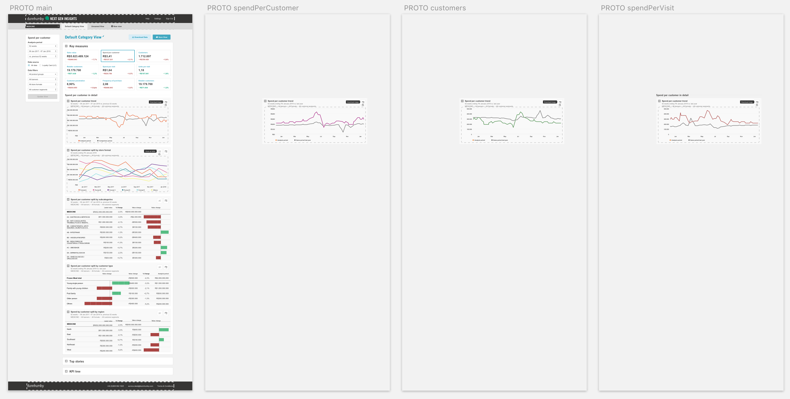
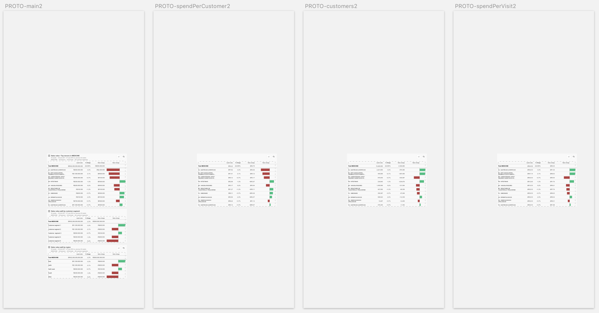

# Assets management

## Where to put assets

Images are stores in an `assets` folder, inside the `src` folder.

Images are imported via an `require` statement at the top of each module, from the assets folder.

## How to preload images managed by Webpack (i.e. included in my src/ directory)

Problem: If for example I am showing some images only conditionally, I want the loading time to be minimal or non-existent.
There are techniques for preloading images, but a lot of them don't work if you manage assets as part of your Webpack system (which is recommended as assets are hashed, and you get build-time errors if any are missing).

Solution: 
- Create an `AssetsLoader` component, inside the `./assets/` folder.
- The job of this component is to:

	- Import _all_ image assets used throughout the app, and export them immediately
	- Render _all_ image assets within a div that is `visibility: hidden`, 0 `height`, 0 `width` and `overflow: hidden` so that the images do not show there – but they are pre-loaded
	
- An `index.ts` file in the `assets/` folder forwards all the named exports from `AssetsLoader`: the component itself, but also all the image assets which it imports.

- All other components throughout the app which need image assets, import the constants that hold the right image asset from `./assets/`.

- `App.tsx` imports the `AssetsLoader` component directly (it's the only component that does), and renders it right at the bottom of the page, so that all images are pre-loaded as part of the initial app loading.


## How I name assets

All image name begin with `PROTOIMG_`. This allows me to easily find all the slices for the prototying inside the source sketch file by searching the document for `PROTOIMG_`.

The next bit of the file name says what the type of the image is, so that all images are organised in types. Eg `nav`, `table`, `graph`, etc.

The next gets get increasingly more specific about what this image represents, and how it's different from others.

If I export different versions of the same image (eg to represent different states of the app), only the very last bit of the filename should change.

Eg:

```
PROTOIMG_graph_customers
PROTOIMG_graph_salesValue
PROTOIMG_graph_spendPerCustomer
PROTOIMG_graph_spendPerVisit

PROTOIMG_kpiTree

PROTOIMG_nav_footer
PROTOIMG_nav_header
PROTOIMG_nav_tabs

PROTOIMG_table_customerTypes_salesValue
PROTOIMG_table_regions_salesValue
PROTOIMG_table_storeFormats_salesValue

PROTOIMG_table_subcategories_customers
PROTOIMG_table_subcategories_salesValue
PROTOIMG_table_subcategories_spendPerCustomer
PROTOIMG_table_subcategories_spendPerVisit
```

The variables holding each assets are always named exactly like the asset, except for the .png file extension.

## Where prototype images come from

All assets come from __1 sketch file__ named `PROTOMASTER.sketch`. 
I.e. if I want to add something new, I either produce it in here, or I paste it in that sketch file and export the slices from that sketch file.

That sketch file is _inside_ the git repository, in the `sketchsource` folder.

## Where the asset names come from

If an asset comes from Sketch, it is __named within sketch__ (i.e. the name is the name of the slice I use to export the asset) and __this asset name is never modified later__.

This allows me to always easily be able to find the source sketch elements of an image, quickly do modifications, reexport the asset in the same location, and see the changes immediately in the app without any extra work. 

## How I orgamyse my sketch file

When I need to export variations of a design (eg to represent different states of the same component), I put each different variation on a different sketch artboard to the right on the first one. This allows me to easily see variations.





## How to show different images based on some condition

1. Import all the image assets the component might display and assign them to different constants:

```
import { PROTOIMG_graph_salesValue, PROTOIMG_graph_customers, PROTOIMG_graph_spendPerCustomer, PROTOIMG_graph_spendPerVisit, PROTOIMG_table_subcategories_customers, PROTOIMG_table_subcategories_salesValue, PROTOIMG_table_subcategories_spendPerCustomer, PROTOIMG_table_subcategories_spendPerVisit, PROTOIMG_table_customerTypes_salesValue, PROTOIMG_table_regions_salesValue, PROTOIMG_table_storeFormats_salesValue, PROTOIMG_kpiTree } from './../../../assets/'
```

2. Use an IIFE with a switch block returning the right constant, right inline when specifying the `src` of the `` html element.

To write an IIFE, write the whole function definition in between `(...)`, then add calling parentheses at the end.

```

```

Note: Remember that switch cases fall through from one another by default in JS.

Note: I tried to replace this IIFE with an assetGetter function, but I didn't manage as it wasn't clear what the return type should be (I don't think there's a clear type in TS for an image asset held in a variable), and returning an `` html element didn't work.

