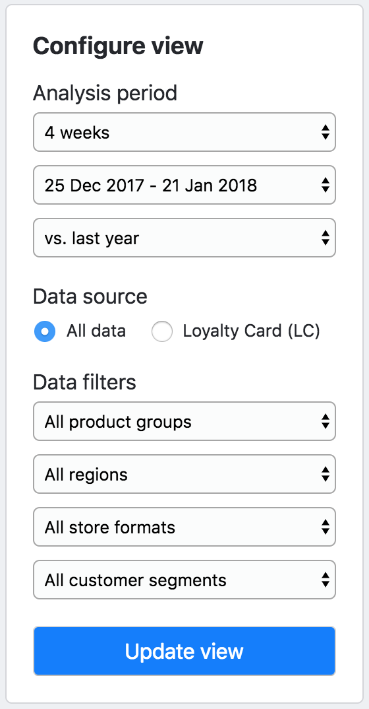

# State management

## Where state is stored

The app's state is stored in 1, and only 1 place: on the `state` property of the root `App` class definition

```
class App extends React.Component<Props, AppState> {
    refToMeasureInDetailBoardHeaderContainingDiv: HTMLDivElement

    state: AppState = {
        selectedFilters: {
            duration: '4 weeks',
            dates: '25 Dec 2017 - 21 Jan 2018',
            comparison: 'vs. previous 4 weeks',
            subcategory: 'All product groups',
            storeFormat: 'All store formats',
            customerSegment: 'All customer segments',
            region: 'All regions',
        },
        displayedFilters: {
            duration: '4 weeks',
            dates: '25 Dec 2017 - 21 Jan 2018',
            comparison: 'vs. previous 4 weeks',
            subcategory: 'All product groups',
            storeFormat: 'All store formats',
            customerSegment: 'All customer segments',
            region: 'All regions'
        },
        dataViewNeedsUpdating: false,

        selectedMeasure: 'Sales value',

        measuresSummaryExpanded: true,
        measuresInDetailExpanded: true,
        KPITreesExpanded: false,

        trendGraphExpanded: false,
        splitBySubcategoryExpanded: false,
        splitByStoreFormatExpanded: false,
        splitByCustomerSegmentExpanded: false,
        splitByRegionExpanded: false,

        measureInDetailBoardHeaderVisible: false,
    }
    
    ...
    
}
```

## Using nesting within the state object

See example above

### Accessing nested pieces of state within components

```
interface Props {
    displayedFilters: FiltersSet,
    selectedMeasure: MeasureName,
}

export class DataSubtitle extends React.Component<Props, {}> {

	...

    render() {
        const {
            selectedMeasure,
            displayedFilters,
        } = this.props

        const {
            duration,
            dates,
            comparison,
            subcategory,
            region,
            storeFormat,
            customerSegment,
        } = displayedFilters
    
    	return ( ... )    
	}
```

## How the type of state is defined

In App.tsx, before the `App` class definition, the `AppState` type is defined as an interface.

```
export interface AppState {

    // FILTERS SELECTION AND RELATED VIEW-LOGIC
    selectedFilters?: FiltersSet,
    displayedFilters?: FiltersSet,
    dataViewNeedsUpdating?: boolean,

    // SELECTED MEASURE 
    selectedMeasure?: MeasureName,

    // DEFINES WHICH CONTENT BOARDS ARE EXPANDED
    measuresSummaryExpanded?: boolean,
    measuresInDetailExpanded?: boolean,
    KPITreesExpanded?: boolean,

    // DEFINES WHICH CONTENT MODULES ARE EXPANDED
    trendGraphExpanded?: boolean,
    splitBySubcategoryExpanded?: boolean,
    splitByRegionExpanded?: boolean,
    splitByStoreFormatExpanded?: boolean,
    splitByCustomerSegmentExpanded?: boolean,

    // MEASURE IN DETAIL HEADER VISIBLE
    measureInDetailBoardHeaderVisible?: boolean,
}
```

Then this `AppState` interface is passed into the `App` class definition as the type for its `state` property.

```
class App extends React.Component<Props, AppState> {
```

If the `AppState` interface makes use of other types in its definition, define these other types just before the `AppState` definition whenever possible.

TODO: EG

## How state gets updated via action handlers

State only gets updated when action functions get called.

__All action handler functions are stored in an object stored on the `actions` property of the `App` class.__

__And I mean all of them, even those that might never get used by any other component than `App` (e.g. actions triggered by event listeners, which live on `App` as well).__ This is for simplicity: any action that changes state lives on this object.

These action function definitions can be grouped into objects stored on the object stored on the `actions` property of the `App` class.

```
actions = {
    updateView: () => {
        this.setState(
            (prevState: AppState) => ({
                displayedFilters: prevState.selectedFilters,
                dataViewNeedsUpdating: false,
            })
        )
    },
    
    ...
    
    selectionChanges: {
        changeSelectedDuration: (newlySelectedDuration: DurationOption) => {
            this.setState(
                (prevState: AppState) => ({
                    selectedFilters: {
                        ...prevState.selectedFilters,
                        duration: newlySelectedDuration,
                        comparison: getComparisonOptions(newlySelectedDuration)[0]
                    },
                    dataViewNeedsUpdating: true,
                } as AppState)
            )
        },
        changeSelectedDates: (newlySelectedDates: DateOption) => {
            this.setState(
                (prevState: AppState) => ({
                    selectedFilters: {
                        ...prevState.selectedFilters,
                        dates: newlySelectedDates
                    },
                    dataViewNeedsUpdating: true,
                } as AppState)
            )
        },
        
        ...
        
    },
    expansionToggles: {
        toggleMeasuresSummaryExpanded: () => {
            this.setState(
                (prevState: AppState) => ({
                    measuresSummaryExpanded: !prevState.measuresSummaryExpanded,
                })
            )
        },
        toggleKPITreesExpanded: () => {
            this.setState(
                (prevState: AppState) => ({
                    KPITreesExpanded: !prevState.KPITreesExpanded
                })
            )
        },
        
		...
    },
}
```

## How setState gets called


### Updating a root key of the state object

When updating a root key of the state object, calling setState is done through the standard method, by passing in a function that receives the previousState object as an argument and returns _parts_ of the new state object.

```
updateView: () => {
    this.setState(
        (prevState: AppState) => ({
            displayedFilters: prevState.selectedFilters,
            dataViewNeedsUpdating: false,
        })
    )
},
```


### Updating part of the nested state object

The function passed into setState always needs to return one or several key/value pairs corresponding to the root keys of the state object.

If I only want to update just a part of one of the value of one of these keys, I use the spread operator to return copy of value of a whole key then make some modifications, so that I can return the whole key/value pair.

```
changeSelectedComparison: (newlySelectedComparison: ComparisonOption) => {
    this.setState(
        (prevState: AppState) => ({
            selectedFilters: {
                ...prevState.selectedFilters,
                comparison: newlySelectedComparison,
            },
            dataViewNeedsUpdating: true,
        } as AppState)
    )
},
```

TODO inc why .. as AppState in some cases
?? WHY Do I need to say 'as AppState'? Or rather, or does this comply to the 'AppState' type?

### Reasons for passing specific props rather than appState, as much as possible

#### Keeping components presentational as much as possible
Only pass down the state object as much as necessary, not more.
As soon as possible, components should get purely presentational.
Do this as soon as possible for each component.

#### Passing just `appState` doesn't allow to pass instance-specific data
Also, when defining a component class, the definition doesn't know which component instance is called.
So any piece of data that needs to be instance-specific values (eg. `expanded`) needs to be passed as a separate prop (rather than the component class definition just receiving the wholesale `appState` object).

eg

```
interface Props {
    title: string
    children: React.ReactNode

    // Connecting the component
    appState: AppState
    
    // Instance specific data extracted from appState upstream
    expanded?: boolean
    
    // Instance specific function extracted from actions upstream
    handleCollapseButtonClick?: React.MouseEventHandler<HTMLElement>
}
```

## Passing down the actions object

The actions are defined in the App class definition, then passed down via props to whatever component instance needs to perform the action.


Eg 

1 Definition of different (but related) actions to be performed by two different instances of the same component
```
actions: {
	...
	expansionToggles: {
	    toggleMeasuresSummaryExpanded: () => {
	        this.setState(
	            (prevState: AppState) => ({
	                measuresSummaryExpanded: !prevState.measuresSummaryExpanded,
	            })
	        )
	    },
	    toggleKPITreesExpanded: () => {
	        this.setState(
	            (prevState: AppState) => ({
	                KPITreesExpanded: !prevState.KPITreesExpanded
	            })
	        )
	    },
	},
	...
}
```

2. These different actions handlers are passed down via props to two different instances of the same component

```
<CollapsibleContentBoard
    title='Performance overview'
    expanded={appState.measuresSummaryExpanded}
    handleCollapseButtonClick={actions.expansionToggles.toggleMeasuresSummaryExpanded}
>

...

<CollapsibleContentBoard
    title='KPI tree'
    expanded={appState.KPITreesExpanded}
    handleCollapseButtonClick={actions.expansionToggles.toggleKPITreesExpanded}
>

...

```

## Typing action handler functions arguments

When defining action handler functions, we need to be clear about what (if any) argument the function needs to receive, and the type of that argument. Same for return types.

#### Action handlers that don't take any argument

If an action handler function doesn't need to know anything about the event – other than the fact that it happened – the action handler will take no argument.
This is typically the case for click action handlers.

Eg
```
updateView: () => {
    this.setState(
        (prevState: AppState) => ({
            displayedFilters: prevState.selectedFilters,
            dataViewNeedsUpdating: false,
        })
    )
}
```

Eg
```
conditionallySetMeasureInDetailBoardHeaderVisibleStateBasedOnScrollY: () => {
    this.setState({
          measureInDetailBoardHeaderVisible: (
            (this.refToMeasureInDetailBoardHeaderContainingDiv.getBoundingClientRect() as DOMRect).top > 0
          ) ? false : true,
    })
}
```

Eg
```
toggleMeasuresSummaryExpanded: () => {
    this.setState(
        (prevState: AppState) => ({
            measuresSummaryExpanded: !prevState.measuresSummaryExpanded,
        })
    )
}
```

#### Action handlers that take an argument of type union of magic strings

Select elements return a string value, and use an array of string values to know what options to display.

The type of their input array can be an union of magic strings, each representing one of the options to select from.

The action handling function that gets triggered when their value change should be of type `(newlySelectedOption: OptionName) => Void`.

```
changeSelectedSubcategory: (newlySelectedSubcategory: MedicineSubcategoryName) => {
    this.setState(
        (prevState: AppState) => ({
            selectedFilters: {
                ...prevState.selectedFilters,
                subcategory: newlySelectedSubcategory,
            },
            dataViewNeedsUpdating: true,
        } as AppState)
    )
},
```

## Typing action handler functions themselves

It's not enough to type the arguments than action handler functions receive.

When a component receives an action handler function as a prop, it also needs to specify it's type so that the prop gets validated.

#### Typing click handler functions

Click event handlers have the type `React.MouseEventHandler<HTMLElement>` from React's types library.
(I don't think it's useful to be more specific on the nature of the HTMLElement here).

Eg from CollapseButton.tsx
```
interface Props {
    // Instance-specific data extracted from appState upsteam
    expanded?: boolean

    // Instance-specific function extracted from actions upstream
    handleClick?: React.MouseEventHandler<HTMLElement>
}
```

#### Typing #action handlers that take an argument of type union of magic strings

Action handlers that take an argument of type union of magic strings can be typed loosely as follows:

Eg from Selector.tsx
```
interface Props {
    optionsArray: string[]
    value: string

    // Instance-specific function extraction from actions upstream
    handleSelectorChange?: (newSelection: string) => void
}
```

This loose typing is useful here as different instances of the Selector component will handle data types as different unions of magic strings.

## State management and Atomic Design

Try to only have Organisms aware of `appState`, and distribute all instance-level data and functions from the organism's class definition. **Organisms compose molecules and atoms.**

i.e. 

- Organisms can have access to appState and actions, but not Molecules or Atoms

- Try to expose as much of the lower level components (i.e. Molecules and Atoms) in the class declaration of Organisms (e.g. by embedding components within one another using `props.children`).

This is so that instance-specific data and functions can be passed to lower-level components at the level of the Organism (which knows about `appState`), so that we don't need to let lower level components know about state, so that they are purely presentational.

--

#### _Unless_ it's really much a throwaway little component that consumes lots of bits of state

Eg DataSubtible
```
<div
    className={s.subTitle}
>
    {`${selectedMeasure} • ${duration} • ${dates} ${comparison}`}
    <br />
    {`${subcategory} • ${region} • ${storeFormat} • ${customerSegment}`}
</div>
```

## Passing down react nodes as props

1. If I am rolling my own prop (i.e. not children) to pass react nodes to a component, it needs to be only _1_ node. So if I want to pass several, I can wrap them in a `div` or a react fragment `<>`.

```
rightNode={
    <> 
        <span
            className={s.measureInDetailBoardRightNodeLabel}
        >
            Selected measure:
        </span>
        <Selector
            optionsArray={measureOptions}
            value={`${selectedMeasure}`}
            handleSelectorChange={changeSelectedMeasure}
        />
    </>
}
```

2. In the component that receives the prop, type the prop as `React.ReactNode`, which means 'anything that can be rendered by React`.

```
interface Props {
    children: React.ReactNode
    headerIsSticky?: boolean
    rightNode?: React.ReactNode
```

3. Then insert the value of the prop using `{ }` in the render return function, just like I do for children props.
(I do not need to place it in `<  />`, it will not work).

```
<div>
	
	...
	
    <div
        className={s.rightNodeContainer}
    >
        {rightNode}
    </div>
</div>
    
{expanded &&
    <div
        className={s.childrenContainer}
    >
        {children}
    </div>
}
```

Note: I can use this `{ }` pattern to insert any javascript value, eg a function call that returns a javascript value.
I can define functions as lightweight components ('almost component', before it becomes one), then call them in the return function.

## Only destructure `const { props } = this`

```
render() {
        const { props } = this

        return (
            <div
                className={classNames(
                    styles.KpiTile,
                    {
                        [styles.selected]: props.selected,
                        [styles.changedUpwards]: props.kpisData.changedUpwards,
                    }
                )}
                onClick={() => props.handleKpiTileClick!(props.measure)}
            >
                <div
                    className={styles.measureName}
                >
                    {props.measure}
                </div>
```

## Driving props from state using any custom logic

__I can use some logic to change props based on state__.

It doesn't have to be just 'pass a piece of state into this prop'. I can also have functions that, given an piece of state (argument), return different values for a prop – using whatever custom logic I want.

For example, here the selected duration changes the data options available (i.e. different data options apply for different durations), and also changes the comparison options available (i.e. different comparison options apply for different durations).

I can write 2 functions that take the duration state as arguments, and return values for date options and comparison options based on it.

```
export function datesOptionsFor(selectedDuration: DurationOption): DateOptionsObject {
    switch (selectedDuration) {
        case '4 weeks': 
            return dateOptionsFor4WeekDuration
        case '12 weeks': 
            return dateOptionsFor12WeekDuration
        case '26 weeks': 
            return dateOptionsFor26WeekDuration
        case '52 weeks': 
            return dateOptionsFor52WeekDuration
        default:
            const _exhaustiveCheck: never = selectedDuration
            return _exhaustiveCheck
    }
}

export function comparisonOptionsFor(selectedDuration: DurationOption): ComparisonOptionsObject {
    switch (selectedDuration) {
        case '52 weeks': 
            return comparisonOptionsFor52WeekDuration
        case '26 weeks': 
            return comparisonOptionsFor26WeekDuration
        case '12 weeks': 
            return comparisonOptionsFor12WeekDuration
        case '4 weeks': 
            return comparisonOptionsFor4WeekDuration
        default:
            const _exhaustiveCheck: never = selectedDuration
            return _exhaustiveCheck
    }
}
```

Then, I can call these functions to pass the right value to the selector prop, dynamically based on state:

```
<Selector
    optionsArray={Object.keys(datesOptionsFor(appState.selectedFilters.duration))}
    value={appState.selectedFilters.dates}
    handleSelectorChange={actions.changeSelected.dates}
/>

...
	
<Selector
    optionsArray={Object.keys(comparisonOptionsFor(appState.selectedFilters.duration))}
    value={appState.selectedFilters.comparison}
    handleSelectorChange={actions.changeSelected.comparison}
/>
```


