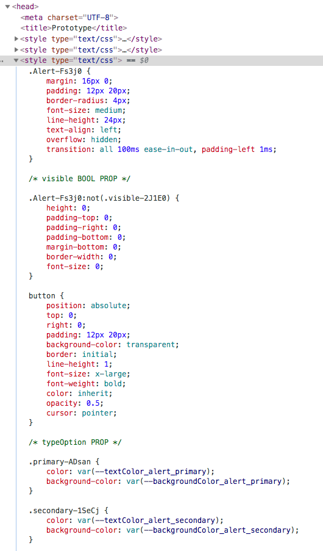
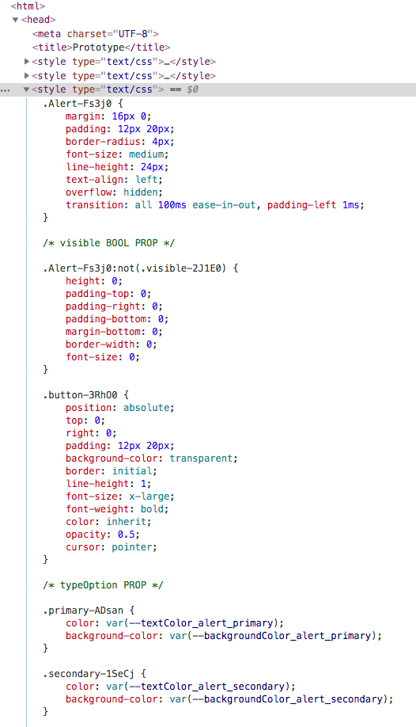

# Styling


## Using css modules

Define a separate CSS file for each component. 

Import the css file into the component. Each component has:
```
import * as styles from './App.css'
```

### Note: If something doesn't work here (eg the CSS module name doesn't get picked up, try restarting the server).

This happened again just now. Just doing a plain CSS Module import (i.e. `import './Button.css'`) didn't report any compile-time error, but the styles never got applied.

And ideally, I wanted to load with `import * as styles from './Button.css` so I can use `typings-for-css-modules-loader`. But when I start a component, I get a compile error on this line, and the module isn't picked up.

Restarting the server didn't work today.

Then I replaced with a standard CSS Module import (i.e. `import './Button.css'`), got that loaded (by also removing `styles.` from the className in the component's render function, temporarily), then reverting it all back to `import * as styles from './Button.css`, and then it worked.


## How to drive style from props

How any conditional / dynamic styling works in my prototypes:

### Classes are applied conditionally only to the outermost `div` / element returned by any component

```
return (
    <button
        className={classNames(
            styles.Button,
            s[typeOption!],
            s[sizeOption!],
            {
                [styles.fullWidth]: fullWidth,
                [styles.disabled]: disabled,
            }
        )}
        onClick={!disabled ? handleButtonClick : (() => { console.log('Button was clicked but is disabled') })}
    >
        {children}
    </button>
)
```

### In my CSS file, I then have conditional rulesets that get applied only if the conditionally applied classname is present, using CSS selectorstyles.

#### 1. The CSS file always starts with the base ruleset, with a className that matches the component's name, in PascalCase

Use PascalCase here to match the name of the component. This is useful in the web inspector to easily see the outermost elements of each of my components, even when they are not expanded.

```
.Button {
    display: flex;
    justify-content: center;
    align-items: center;
    border-radius: 4px;
    font-size: medium;
    cursor: pointer;
    width: max-content;
    background-color: red;
}
```

#### 2. For props of type boolean, the conditional bit is simply 1 extra ruleset that either gets applied or not, depending on whether the prop is true or false

These are placed under a `/* boolean */` marker

```
/* bool */

.fullWidth {
    width: 100%;
}

.disabled {
    background-color: var(--backgroundColor_button_disabled);
}
```

#### 3. For props of type union of magic strings, each possible string value of the prop has a ruleset in CSS, which gets applied or not depending on whether the value of the prop matches this string

Each prop of tyle union of magic strings has its own marker in the CSS file

```
/* typeOption */

.primary {
    background-color: var(--backgroundColor_button_primary);
    color: white;
}

.secondary {
    background-color: var(--backgroundColor_button_secondary);
    color: white;
}

.success {
    background-color: var(--backgroundColor_button_success);
    color: white;
}

.danger {
    background-color: var(--backgroundColor_button_danger);
    color: white;
}

...

/* sizeOption */

.small {
    padding: 4px 8px;
    line-height: 21px;
}

.medium {
    padding: 6px 12px;
    line-height: 24px;
}

.large {
    padding: 8px 16px;
    line-height: 30px;
}
```

#### Sometimes, it makes more sense to use this negative pattern using a :not(.conditionalClassName) selector

```
.Alert {
    margin: 16px 0;
    padding: 12px 20px;
    border-radius: 4px;
    font-size: medium;
    line-height: 24px;
    text-align: left;
    overflow: hidden;
    transition: all 100ms ease-in-out, padding-left 1ms;
}

/* visible BOOL PROP */

.Alert:not(.visible) {
    height: 0;
    padding-top: 0;
    padding-right: 0;
    padding-bottom: 0;
    margin-bottom: 0;
    border-width: 0;
    font-size: 0;
}
```

#### The conditional className applied to the outermost element of the component drives the styling of elements nested any level further down (rather than just the styling of the outermost element) using the by chaining selectors (with or without `>`)


Eg 1 from `Alert.css`:


```
.visible > button {
    position: absolute;
    top: 0;
    right: 0;
    padding: 12px 20px;
    background-color: transparent;
    border: initial;
    line-height: 1;
    font-size: x-large;
    font-weight: bold;
    color: inherit;
    opacity: 0.5;
    cursor: pointer;
}
```


# Tooling

## Use CSS Modules, but __beware that only names are scoped locally__ (not html elements) 


### What CSS modules do

When I import a `.css` file like this in a component ..
`import * as stylestyles from './MyComponent.css'`

__.. I get a `styles` object in the scope of the component, which has the class names defined in the `.css` file as keys, and for each of these keys associate a unique class name.__

This `styles` object is really in scope of my component. (I can print if I want):
`console.log(stylestyles.primary)`

I can then use this `style` object to assign locally-scoped, unique class names to different html elements in this file.

Eg in `Alert.tsx`:

```
<button
    className={classNames(stylestyles.button)}
    type='button'
    onClick={() => { }}
    >
    ×
</button>
```

## !! Beware that CSS Modules only hash class names in selectors – not html elements

__This means that only rule sets using class names in selectors are scoped locally to the component – not rulesets just using html elements__.

#### Eg in `Alert.css` (version 1, with a naming conflict):

```
button {
    position: absolute;
    top: 0;
    right: 0;
    padding: 12px 20px;
    background-color: transparent;
    border: initial;
    line-height: 1;
    font-size: x-large;
    font-weight: bold;
    color: inherit;
    opacity: 0.5;
    cursor: pointer;
}

```

This would appear as, with a naming conflict:



#### Eg  in `Alert.css` (version 2, without naming conflict):

```
.button {
    position: absolute;
    top: 0;
    right: 0;
    padding: 12px 20px;
    background-color: transparent;
    border: initial;
    line-height: 1;
    font-size: x-large;
    font-weight: bold;
    color: inherit;
    opacity: 0.5;
    cursor: pointer;
}

```

This would appear as, without naming conflict:




## Using the `className` dependency to facilitate applying CSS rulesets conditionally

__`'classnames'` is a simple JavaScript utility for conditionally joining classNames together.__

Eg

```
classNames('foo', 'bar'); 					// => 'foo bar'
classNames('foo', { bar: true }); 		// => 'foo bar'
classNames({ 'foo-bar': true }); 			// => 'foo-bar'
classNames({ 'foo-bar': false }); 		// => ''
classNames({ foo: true }, { bar: true }); // => 'foo bar'
classNames({ foo: true, bar: true }); 	// => 'foo bar'
```

Essentially:
- Any string I give it as an argument, gets added to the string that I assign to `className`
- I can use a string as an object key, with an associated boolean value. At runtime, if that value is true, the strings gets added, but not if it's false.

This allows me to very easy apply, or not apply, CSS classes based on a boolean value that I got frop props or state.

Eg

```
<button
    className={classNames(
        'Button',
        typeOption,
        sizeOption,
        {
            'fullWidth': fullWidth,
            'disabled': disabled,
        }
    )}
    onClick={!disabled ? handleButtonClick : (() => { console.log('Button was clicked but is disabled') })}
>
    {children}
</button>
```

#### Using the classNames(..) function to dynamically, conditionally construct strings for the `className` tag

```
className(
	'Button',
			// always adds the 'Button' class name to the returned string
	typeOption,
	sizeOption,
			// always adds the typeOption and sizeOption strings (passed through props) to the returned string
	{
		'fullWidth': fullWidth,
	   	'disabled': disabled,
			// adds the 'fullWidth' and 'disabled' string only if the fullWidth and disabled bools evaluate to true   	
	}	
)
```

#### If using computed strings (i.e. variables/const that evaluate as strings) as object keys for conditionally applying CSS classes, remember to use the computed key object creation syntax: {[myComputedKeyOfTypeString]: value}

```
<button
    className={classNames(
        styles.Button,
        s[typeOption!],
        s[sizeOption!],
        {
            [styles.fullWidth]: fullWidth,
            [styles.disabled]: disabled,
        }
    )}
    onClick={!disabled ? handleButtonClick : (() => { console.log('Button was clicked but is disabled') })}
>
    {children}
</button>
```


## Using typechecking to ensure that I'm only using CSS rulesets that do exist in the CSS file

`typings-for-css-modules-loader` is a small npm module that is a
__'Drop-in replacement for css-loader to generate typings for your CSS-Modules on the fly in webpack'__


0. Install `typings-for-css-modules-loader` as a devDependency

1. Import each component's CSS file `* as styles`.

```
import * as styles from './App.css'
```

2. In my component's render function's return statement, where I'd normally name a CSS class using a string, put `styles.nameOfMyCSSruleSet`

What `typings-for-css-modules-loader` does is create an ambient declaration file with a `string` type declaration for each of the values in the keys of `stylestyles.myClassName`.
This only works if_ that className exists on the `.css` file.__ (otherwise there's no corresponding key on the `styles` object).

__This allows me to get compile-time warnings if I'm trying to access a key on `styles` that doesn't exist.__


eg 1: CSS classed applied conditionally to the outermost `div` returned by the component
```
<div
    className={classNames(
        styles.CollapsibleContentModule,
        {
            [styles.expanded]: expanded,
        }
    )}
>
	...
</div>
```

eg 2

```
<div
    className={styles.collapseButtonContainer}
>
    <CollapseButton
        expanded={expanded}
        handleClick={handleCollapseButtonClick}
    />

</div>
```

eg3

```
<button
    className={classNames(
        styles.Button,
        s[typeOption!],
        s[sizeOption!],
        {
            [styles.fullWidth]: fullWidth,
            [styles.disabled]: disabled,
        }
    )}
    onClick={!disabled ? handleButtonClick : (() => { console.log('Button was clicked but is disabled') })}
>
    {children}
</button>
```

### When the type of the prop is an union of magic strings, and hence the value of the prop can be one of several strings (and one is always applied), a className is always applied, but which one is applied depends on the value of the prop

```
interface Props {
    children: React.ReactNode
    typeOption?: 'primary' | 'secondary' | 'success' | 'danger' | 'warning' | 'info' | 'light' | 'dark'
    dismissable?: boolean
    
    // State data selected from appState upstream
    visible: boolean

    // Instance-specific function extracted from actions upstream
    handleClick?: React.MouseEventHandler<HTMLElement>
}
```

```
return (
    <button
        className={classNames(
            styles.Button,
            s[typeOption!],
            s[sizeOption!],
            {
                [styles.fullWidth]: fullWidth,
                [styles.disabled]: disabled,
            }
        )}
        onClick={!disabled ? handleButtonClick : (() => { console.log('Button was clicked but is disabled') })}
    >
        {children}
    </button>
)
```

__Note: `s[typeOption!]` is for a `typeOption` prop that returns one of several possible strings (as per the Props type), each of which matches a css class in the `.css` file.__

```
interface Props {
    children: React.ReactNode
    disabled?: boolean
    fullWidth?: boolean
    typeOption?: 'primary' | 'secondary' | 'success' | 'danger' | 'warning' | 'info' | 'light' | 'dark'
    sizeOption?: 'small' | 'medium' | 'large'

```

__The `!` is here because TS doesn't know about React's `defaultProps`, so it doesn't know that a value will always be supplied for `typeOption` and `sizeOption`__

#### Note: If something doesn't work here (eg the CSS module name doesn't get picked up, try ..
1 restarting vscode and the server
2a doing a basic css module import instead (ie. `import './Button.css'`)
2b updating the assignment to the `className` tag so that it takes a simple string, without the `styles.` from `typings-for-css-modules-loader`
3 Putting back the import and class assignment syntax as they need to be with `typings-for-css-modules-loader`
4 restarting vscode and the server


# Structure of the CSS files

All the CSS files in my prototypes follow the same structure:

## Base style comes first, and uses the same name as the component

```
.Button {
    display: flex;
    justify-content: center;
    align-items: center;
    border-radius: 4px;
    font-size: medium;
    cursor: pointer;
    width: max-content;
}
```

## Conditionally applied rulesets are organised under markers for clarity.

### a `/* ... BOOL PROP */` marker is followed by _any/all ruleset(s) that gets applied based on that boolean prop_.

__Every ruleset that conditionally apply based on that bool prop should be placed after this marker.__


Eg 1

```
/* fullWidth BOOL PROP */

.fullWidth {
    width: 100%;
}
```

Eg 2

```
/* visible BOOL PROP */

.Alert:not(.visible) {
    height: 0;
    padding-top: 0;
    padding-right: 0;
    padding-bottom: 0;
    margin-bottom: 0;
    border-width: 0;
    font-size: 0;
}

.visible > button {
    position: absolute;
    top: 0;
    right: 0;
    padding: 12px 20px;
    background-color: transparent;
    border: initial;
    line-height: 1;
    font-size: x-large;
    font-weight: bold;
    color: inherit;
    opacity: 0.5;
    cursor: pointer;
}
```

### a `/* ...Option */` marker means that one of the following rules will apply, based on a prop that's of type union of magical strings

```
/* typeOption */

.primary {
    background-color: var(--backgroundColor_button_primary);
    color: white;
}

.secondary {
    background-color: var(--backgroundColor_button_secondary);
    color: white;
}

.success {
    background-color: var(--backgroundColor_button_success);
    color: white;
}

.danger {
    background-color: var(--backgroundColor_button_danger);
    color: white;
}

.warning {
    background-color: var(--backgroundColor_button_warning);
    color: white;
}

.info {
    background-color: var(--backgroundColor_button_info);
    color: white;
}

.light {
    background-color: var(--backgroundColor_button_light);
    color: white;
}

.dark {
    background-color: var(--backgroundColor_button_dark);
    color: white;
}

/* sizeOption */

.small {
    padding: 4px 8px;
    line-height: 21px;
}

.medium {
    padding: 6px 12px;
    line-height: 24px;
}

.large {
    padding: 8px 16px;
    line-height: 30px;
}
```

## !! Important note: when different CSS rulesets give conflicting assignment to the same property, the order that matters is the order in which they appear in the `.css` file, now the order of the class names into the `className` tag. !!

Eg:

Let's take the example of a component were different rulesets set `background-color` to different values:
- the `typeOption` string values (i.e. `primary`, `secondary`, `warning`, etc) set `background-color` to different values
- the `disabled` ruleset set `background-color` to grey

### In Button.tsx:
Notice how the `disabled` class name will appear last in the list of class names passed into the `className` tag.

```
<button
    className={classNames(
        styles.Button,
        s[typeOption!],
        s[sizeOption!],
        {
            [styles.fullWidth]: fullWidth,
            [styles.disabled]: disabled,
        }
    )}
    onClick={!disabled ? handleButtonClick : (() => { console.log('Button was clicked but is disabled') })}
>
    {children}
</button>
```

### In Button.css, version 1 (incorrect):

Because `disabled` appears last in the string passed into the `classname` string, I'd be forgiven to believe that the `.disabled {}` ruleset will be applied last, and hence have the last word.

However that's not the case, that's not how it workstyles.

With the order below, the button's `background-color` will never be grey, even when `disabled` is true.

```
/* bool */

.disabled {
    background-color: var(--backgroundColor_button_disabled);
}

/* typeOption */

.primary {
    background-color: var(--backgroundColor_button_primary);
    color: white;
}

.secondary {
    background-color: var(--backgroundColor_button_secondary);
    color: white;
}

.success {
    background-color: var(--backgroundColor_button_success);
    color: white;
}

...

```

### In Button.css, version 2 (correct): 

In fact, __it's the order in which the ruleset appear in the `.css` file (not the order in which the different classnames appear in the string assigned to `className`) that determines which ruleset with conflicting property assignment will have the last word__.

__Rulesets that appear latest in the `.css` file have the last word over rulesets that appear previously in the file. Where the name of the class sits in the string passed into the `className` tag doesn't matter.__

So this is the correct implementation if I want `.disabled{ .. }`'s `background-color` to trump the instructions from the button type option rulesetstyles.

```
/* typeOption */

.primary {
    background-color: var(--backgroundColor_button_primary);
    color: white;
}

.secondary {
    background-color: var(--backgroundColor_button_secondary);
    color: white;
}

.success {
    background-color: var(--backgroundColor_button_success);
    color: white;
}

.danger {
    background-color: var(--backgroundColor_button_danger);
    color: white;
}

.warning {
    background-color: var(--backgroundColor_button_warning);
    color: white;
}

.info {
    background-color: var(--backgroundColor_button_info);
    color: white;
}

.light {
    background-color: var(--backgroundColor_button_light);
    color: white;
}

.dark {
    background-color: var(--backgroundColor_button_dark);
    color: white;
}

/* bool */

.disabled {
    background-color: var(--backgroundColor_button_disabled);
}
```


## I chain selector in plain CSS (rather than using nesting in post css) to select elements within the surrounding element which gets the base class

### `>` means 'directly one level down in the html nesting

So `.visible > button {..}` is a ruleset that gets applied to any `button` html element that might be 1 level down in the html nesting hierarchy from an element that has a class name of `visible`.

#### Eg 1 Alert component 

In `Alert.tsx`:

```
<div
    className={classNames(
        styles.Alert,
        s[typeOption!],
        {
            [styles.visible]: visible
        }
    )}
    onClick={handleClick}
>
    {children}

    {dismissable &&
        <button
            type='button'
            onClick={() => { }}
        >
            ×
        </button>
    }
</div>
```

In `Alert.css`:

```
.visible > button {
    position: absolute;
    top: 0;
    right: 0;
    padding: 12px 20px;
    background-color: transparent;
    border: initial;
    line-height: 1;
    font-size: x-large;
    font-weight: bold;
    color: inherit;
    opacity: 0.5;
    cursor: pointer;
}
```

#### Eg 2 Sidebar component

In `Sidebar.tsx`:

```
<form
    className={styles.radiosAndLabels}
>
    <input
        type='radio'
        id='dataSourceChoice1'
        name='dataSource'
        value='All data'
        defaultChecked
    />

    <label
        htmlFor='dataSourceChoice1'
    >
        All data
    </label>

    <input
        type='radio'
        id='dataSourceChoice2'
        name='dataSource'
        value='Loyalty Card'
    />

    <label
        htmlFor='dataSourceChoice2'
    >
        Loyalty Card (LC)
    </label>
</form>
```

In `Sidebar.css`:
Note how in this example, there's no ruleset corresponding to the `radiosAndLabels` class name, but the name is still used to apply styles to its immediate children. The `rationsAndLabels` class name is used a way to group the children html elements, and as a way to style them conveniently without long, protracted CSS class namestyles.

```
.radiosAndLabels > input {
    width: 15px;
    height: 15px;
}

.radiosAndLabels > label {
    font-size: small;
    margin-left: 5px;
}

.radiosAndLabels > label:first-of-type {
    margin-right: 17px;
}
```

### a 2nd .classname/html element/#id appearing after a 1st .classname/html element/#id means 'any .classname/html element/#id that appears at any level further down the nesting hierarchy vs the 1st .classname/html element/#id


__Note: Use `>` whenever I'm selecting immediate children, rather than not.__

## Conditionally applied class name _only get applied to the component's outermost html element_. I use that classname in a chain of selector to conditionally apply style to any html element further down the nesting hierarchy

#### Eg 1 from the CollapsibleContentBoard component:

In `CollapsibleContentBoard.tsx`:
Notice how the outermost html element (here, a `div`) gets applied the `headerIsSticky` and `headerHighlighted` class names conditionally.

```
<div
    className={classNames(
        styles.CollapsibleContentBoard,
        {
            [styles.expanded]: expanded,
            [styles.headerIsSticky]: headerIsSticky,
            [styles.headerHighlighted]: headerHighlighted
        }
    )}
>
    <div
        className={styles.headerContainer}
        ref={refAssignmentFunctionforHeaderContainingDiv}
    >
    ...
    </div>
...
</div>
```

In `CollapsibleContentBoard.css`:
__These classnames that are conditionally applied to the outermost html element are then used in a selector chain to conditionally trigger CSS rulesets to apply to html elements lower down the nesting hierarchy.__

```
/* headerIsSticky BOOL PROP */

.headerIsSticky > .headerContainer {
    position: -webkit-sticky;
    position: sticky;
    top: 0;
    z-index: 1;
}

/* headerIsHighlighted BOOL PROP */

.headerHighlighted > .headerContainer {
    box-shadow: 0 2px 4px var(--shadowColor_default);
    background-color: #fffe;
    transition: box-shadow 200ms;
}
```

#### Eg 2 from the KpiTile component:

In `KpiTile.tsx`:

```
<div
    className={classNames(
        styles.KpiTile,
        {
            [styles.selected]: selected,
            [styles.changedUpwards]: kpisData.changedUpwards,
        }
    )}
>
    <div
        className={styles.measureName}
    >
    	...
    </div>
</div>
```

In `KpiTile.css`:

```
/* selected BOOL PROP */

.selected {
    border: 3px solid var(--borderColor_button_info);
    cursor: default;
}

.selected > .measureName {
    color: var(--textColor_default);
}

.KpiTile:hover:not(.selected) {
    border: 2px solid var(--borderColor_button_info);
}
```

The 1st ruleset applies to any element that has the `selected` class name (that's the outermost div for us).

The 2nd ruleset applies to any element with class name `measureName` that is an immediate child of an element with class name `selected`.

The 3rd ruleset applies to any element with a `KpiTile` classname that also is hovered and also doesn't have a `selected` className.


## How to read a CSS selector chain:

#### Eg 1 'Apply this ruleset to any element that has a `headerContainer` class and that is an immediate child of an element with a `headerIsSticky` class, if there's any.

```
.headerIsSticky > .headerContainer {
    position: -webkit-sticky;
    position: sticky;
    top: 0;
    z-index: 1;
}
```

#### Eg 2 'Apply this ruleset to any element that has a `headerContainer` class and that is an immediate child of an element with a `headerHighlighted` class, if there's any.

```
.headerHighlighted > .headerContainer {
    box-shadow: 0 2px 4px var(--shadowColor_default);
    background-color: #fffe;
    transition: box-shadow 200ms;
}
```

#### Eg 3 'Apply this ruleset to any element with a `KpiTile` class name AND that is hovered AND that doesn't have the `selected` classname

```
.KpiTile:hover:not(.selected) {
    border: 2px solid var(--borderColor_button_info);
}
```

#### Eg 4 'Apply this ruleset to any element with a `Alert` class name AND that doesn't have the `visible` classname

```
/* visible BOOL PROP */

.Alert:not(.visible) {
    height: 0;
    padding-top: 0;
    padding-right: 0;
    padding-bottom: 0;
    margin-bottom: 0;
    border-width: 0;
    font-size: 0;
}
```

# Defining a prototyping colour palette using CSS properties in index.css

```
:root {
/* COLOR REFERENCES */
--color_shark: #25272c;

/* BOOTSTRAP PALETTE */
--color_azureRadiance: #007bff;
--color_greenHaze: #01a368;
--color_cinnabar: #e34234;
--color_easternBlueLight: #1e9ab0;
--color_outerSpace: #2d383a;
--color_paleSky: #6e7783;
--color_iron: #d4d5d9;
--color_athensGray: #eef0f3;
--color_fbfbfc: #fbfbfc;

/* DUNNHUMBY PALETTE */
--color_tuatara: #363534;

/* TEXT COLOR PALETTE */
--textColor_default: var(--color_shark);
--textColor_grey: var(--color_paleSky);
--textColor_links_active: var(--color_azureRadiance);
--textColor_links_disabled: var(--color_paleSky);
--textColor_alert_primary: #004085;

...
}
```

Here's how to use these colour references in a component's css file:
```
color: var(--textColor_default);
```


# Reseting some default styles in index.css

```
html {
	font-size: 10px;
	font-family: system-ui, sans-serif;
	color: var(--textColor_default);
}

body {
	margin: 0;
	background-color: var(--backgroundColor_backgrounds_athensGray);
}

* {
	box-sizing: border-box;
}

p {
	margin: 0;
}

div {
	user-select: none;
}
```

# How to animate

### Whenever possible, prefer simple transitions rather than keyframe animations

Eg 

```
.Alert {
    margin: 16px 0;
    padding: 12px 20px;
    border-radius: 4px;
    font-size: medium;
    line-height: 24px;
    text-align: left;
    overflow: hidden;
    transition: all 100ms ease-in-out, padding-left 1ms;
}
```

Eg from CollapsibleMeasureInDetailBoard.css

```
/* headerIsHighlighted BOOL PROP */

.headerContainerVisible .headerContainer {
    box-shadow: 0 2px 4px var(--shadowColor_default);
    background-color: #fffe;
    transition: box-shadow 200ms;
}

```

## How to make keyframe animations work

- The animation must be triggered when the properties that it animates are being updated to new valuestyles.
I.e. at the end of the animation, the animated properties don't automatically keep their `to` valuestyles.
I must trigger the animation in the same rule set where I also update the properties that I animate to values that match to `to` values of the animation.

- In the same way, the `from` values of the animation should match the values of the same properties before this class becomes active.

eg
```
/* headerIsHighlighted BOOL PROP */

.headerContainerVisible .headerContainer {
    box-shadow: 0 2px 4px var(--shadowColor_default);
    background-color: #fffe;
    animation: flash 200ms;
}

@keyframes flash {
    from {
        box-shadow: 0 0 0 white;
        background-color: transparent;
    }

    to {
        box-shadow: 0 2px 4px var(--shadowColor_default);
        background-color: #fffe;
    }
}
```

Note: both `animation` and `transition` only happen in 1 direction (i.e. only when the corresponding classname gets added to the element)
If I wanted to animate in both directions (i.e. also when it gets removed), I could probably define a corresponding animation with an opposed selected, maybe using something like `:not(.headerContainerVisible)`

Note: This example is so simple that it wouldn't require keyframe animation. Here's the equivalent (as `background-color` didn't need to be animated anyway).

```
.headerContainerVisible .headerContainer {
    box-shadow: 0 2px 4px var(--shadowColor_default);
    background-color: #fffe;
    transition: box-shadow 200ms;
}
```


# The `display` property

#### Displaying things inline: i.e. one element, then the next, on the same line.

__I do not need flexbox or grid to do this, just `span` (or anything else if it's set to `display: inline-block`).__

I can display a `div` inline by applying the CSS rule `display: inline-block`.
But I might as well change the `div` for a `span`, which has the same effect.

```
rightNode={
    <> 
        <span
            className={styles.measureInDetailBoardRightNodeLabel}
        >
            Selected measure:
        </span>
        <Selector
            optionsArray={measureOptions}
            value={`${selectedMeasure}`}
            handleSelectorChange={changeSelectedMeasure}
        />
    </>
}
```
